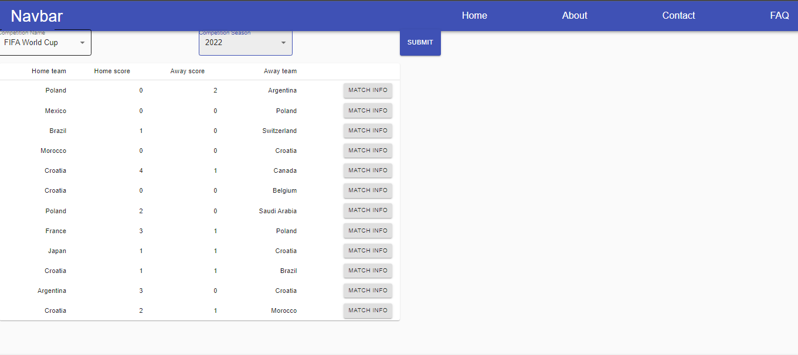
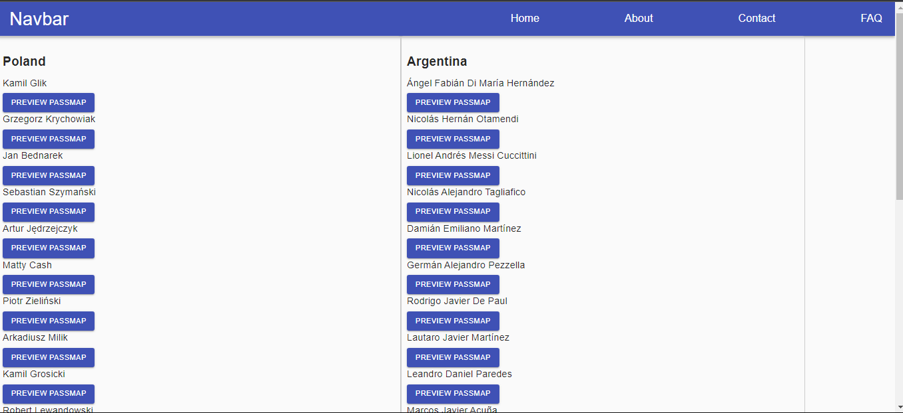
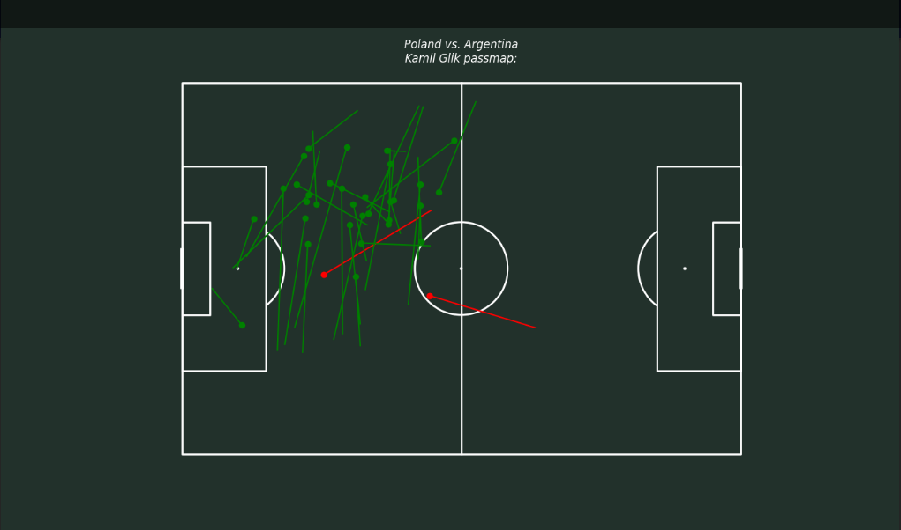

# StatsbombApp README

## Overview

-   This is a web application that combines Django, SQL, and React to create a modern and dynamic web experience.
-   Application uses data from open-source Python module `statsbombpy`.
    This module contains metrics from multiple football competitions and is freely available for public use for research projects and genuine interest in football analytics.
-   Main feature of the application is visualisation of passes made by chosen player in given match
-   Presented below there are basic views from application:
    -   Home page view afer submitting football competition data form:
        
    -   Match information view (list of all players in both teams):
        
    -   Passmap of selected player:
        

## Features

-   Database schema using SQL.
-   Database was fetched from statsbombpy python module
-   RESTful API with Django REST framework.
-   React front-end for a dynamic user interface.
-   Customizable and extendable architecture.

## Installation

1. Clone the repository:

    ```
    git clone https://github.com/mich704/stastbombAPP.git
    ```

2. Install Python dependencies:

    ```
    pip install -r requirements.txt
    ```

3. Set up the database:

    ```
    python manage.py migrate
    ```

4. Start the development server:

    ```
    python manage.py runserver
    ```

    Now you can navigate to http://127.0.0.1:8000/ to access the application.

## Configuration

-   Database settings can be configured in `statsbombApp/settings.py`.
-   React front-end is located in the `frontend` directory.

## API Endpoints

-   API endpoints are available at `/api/`. You can extend these by adding Django REST framework views.

## Front-end Development

To work on the React front-end:

1. Navigate to the `frontend` directory.
2. Install front-end dependencies:
    ```
    cd frontend
    npm install
    ```
3. Start the development server for the front-end:
    ```
    npm start
    ```
4. Visit `http://localhost:3000` for the React development server.
